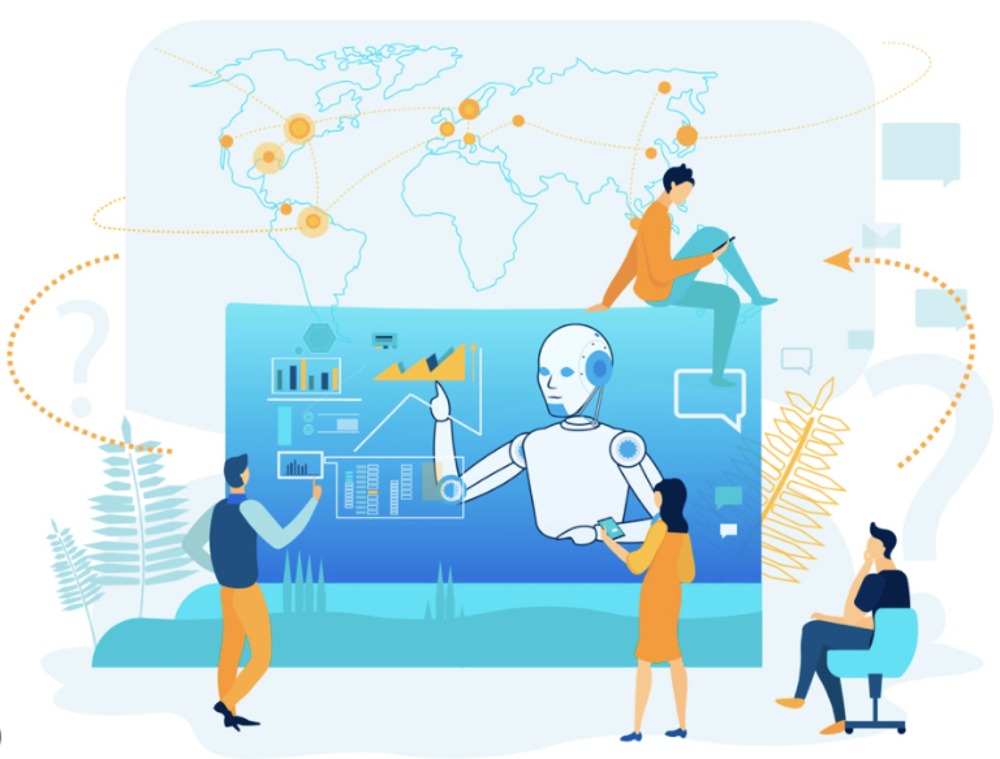

<!-- Section 1: profile image -->

  
  <h1 style="position: absolute; top: 50%; left: 50%; transform: translate(-50%, -50%); color: blue; font-size: 3rem;">Hi, I'm Sagar Vyas</h1>
  
Passionate and expereince IT Professional

---

<!-- Section 2: Connect with Me -->

  <h2 style="color: white;">🌐 Connect with Me</h2>
  
Email: [Your Email](mailto:sagarvyas147@gmail.com)

  
LinkedIn: [LinkedIn Profile](https://www.linkedin.com/in/yourlinkedinprofile)

---

# About Me

Experienced Senior IT Professional | Transforming Businesses through Technology | Tech Enthusiast | Problem Solver
I am a passionate IT professional with expertise in...

## Professional Summary

🔥 A seasoned IT leader with 14+ years of experience, specializing in IT across Banking , Telecom , Transportation domain

🚀 I thrive on leveraging cutting-edge technologies to drive innovation and strategic growth

🔭 I'm currently working on cloud transformation , GCP architect, DevOps lead. Leading cloudification.

🌱 Constantly learning and adapting to new technologies

---

## 💼 Key Highlights

- Led and mentored cross-functional teams of [Team Size] to deliver mission-critical projects on time and within budget.
- Orchestrated successful [Technology Implementations/Transformations] resulting in [Tangible Outcomes].
- Proven track record of optimizing processes, reducing costs, and enhancing operational efficiency.
- Deep expertise in [Key Technologies/Tools] with a focus on [Specific IT Domain].

---

## 🛠️ Technical Proficiencies

- Languages: English, Hindi
- Frameworks: [Frameworks], [Tools]
- Cloud: Google Cloud (GCP), AWS , OTC (Open Telekom Cloud), Azure
- DevOps: Kubernetes , Docker , CICD, Gitlab , Sonar ,
- Databases: Oracle , mysql , mariadb , cloudSQL , cloud Spanner, MongoDB , AWS RDS.

---

## 💼 professional Experience

### [Current/Previous Job Title] at Deutsche Telekom || T-Systems ICT India Pvt. Ltd  | [11-11-2021 to till date]

[T-systems Website](https://www.t-systems.com/in/en) 
[Deutsche Telekom Website](https://www.telekom.com/en/company/companyprofile/company-profile-625808)

Description:
Key Responsibility:
Achivevements:
Tech Stack:
- Led a team of [Team Size] in [Achievements or Projects]
- Implemented [Specific Achievements or Technologies] resulting in [Quantifiable Results]
- Collaborated with cross-functional teams to [Collaborative Projects]

### [Previous Job Title] at Vodafone Intellient solution | [Date Range]

[Vodafone Intellient solution Website](https://www.vodafone.com/careers/professional-career-areas/shared-services)

- Managed [Responsibilities] for [Project or Team]
- Developed and maintained [Key Systems/Projects]
- Improved [Processes/Results] by implementing [Improvements]

### [Previous Job Title] at Fujitsu India | [Date Range]
[Fujitsu India Website](https://www.fujitsu.com/in/)

### [Previous Job Title] at MasterCard (ElectraCard Services)  | [Date Range]

MasterCard acquired ECS in 2014 [Offical annocement] (https://timesofindia.indiatimes.com/business/india-business/mastercard-acquires-pune-based-processing-company/articleshow/35335427.cms)

### [Previous Job Title] at Global Infotect  | [Date Range]

---
## 🚀 Projects

[Project 1 Application migration](https://github.com/yourusername/project1): Brief description and key technologies.
     
   **Description** :
   **Technologies Used**:
   **Tech stack** :
   **Achivevements**:
  

- [Project 2 Infrastructure Transformation](https://github.com/yourusername/project2): Summary and notable accomplishments.
  
   **Description** :
   **Technologies Used**:
   **Tech stack** :
   **Achivevements**:
   

- [Project 3 DAA "Data to AI analytics"](https://github.com/yourusername/project3): Highlights and impact.

  **Description** :
  **Technologies Used**:
  **Tech stack** :
  **Achivevements**:
  

Project 1: Project Name

- **Description**: A brief description of the project.
- **GitHub Repository**: [Link](https://github.com/yourusername/project1)
- **Live Demo**: [Link](https://yourwebsite.com/project1-demo)
- 

---
## 📈 GitHub Stats

---

## 🌐 Connect with Me

[LinkedIn](https://www.linkedin.com/in/yourlinkedinprofile) | 
[Twitter](https://twitter.com/yourtwitterhandle) | 
[Website](https://sagar-vyas-cloudification.github.io/DataCloudAI-Excellence-Portfolio/)

---
